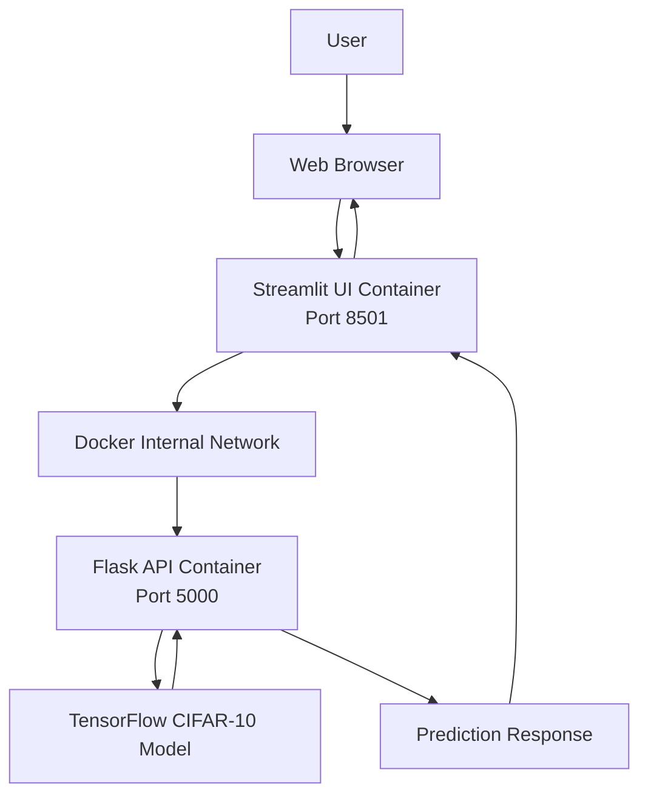

# Task 11: Full Application Containerization

## System Architecture

The application consists of a Streamlit frontend, Flask REST API,
TensorFlow deep learning model, and Docker Compose orchestration.

## Architecture Diagram

## Components

### Streamlit
Provides image upload, prediction interaction, and result visualization.

### Flask
Accepts image uploads, performs preprocessing, invokes the model,
and returns prediction results in JSON format.

### TensorFlow
Loads the trained CIFAR-10 CNN and produces class probabilities.

### Docker Compose
Builds and starts the services and manages their internal communication.

## Ports

- Streamlit: 8501
- Flask: 5000

## Data Flow

1. User uploads an image.
2. Streamlit sends the image to Flask.
3. Flask converts the image to RGB and resizes it to 32 × 32.
4. Pixel values are normalized.
5. TensorFlow performs inference.
6. Flask returns the predicted class and probabilities.
7. Streamlit displays the result.